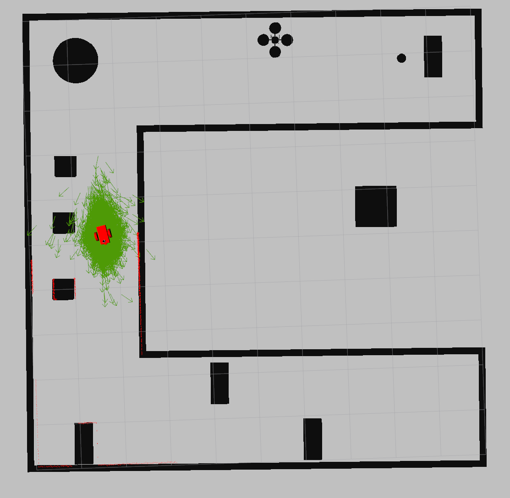
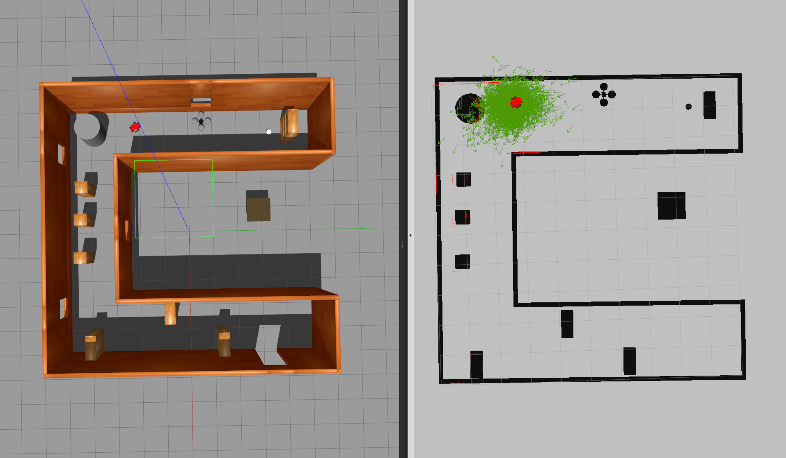
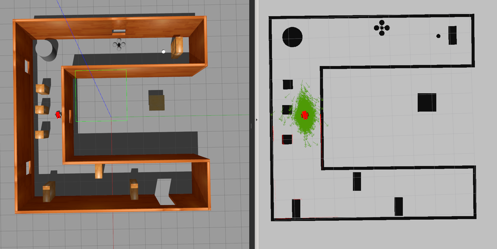

# udacity-robond-p3

**Where Am I? - Project 3 of the Udacity Robotics Software Engineer Nanodegree**

## Description

This project contains:

1. A two-wheeled robot model (URDF) which is equiped with a camera and a lidar.
2. A customized world supported by Gazebo. 
3. Two ROS packages: the `localization` and the `my_robot` , which enable the robot to localize itself using Adaptive Monte Carlo Localization (http://wiki.ros.org/amcl) method.

## Run 

`roslaunch my_robot world.launch`

`roslaunch localization amcl.launch`

- To make the robot localize itself, you need to tele-operate the robot to move from starting position (bottom-right corner) to another end of the house (top-right corner).

## Behavior

 

 

