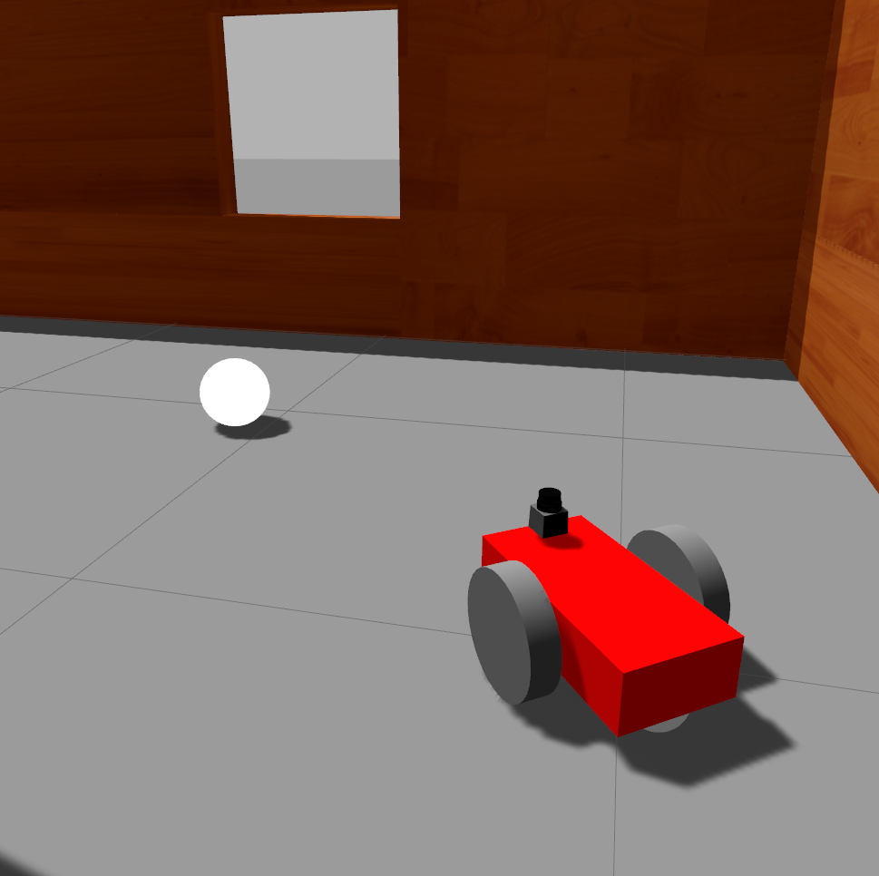

# udacity-robond-p2

Go Chase It! - Project 2 of the Udacity Robotics Software Engineer Nanodegree

## Description

This project contains:

1. A two-wheeled robot model (URDF) which is equiped with a camera and a lidar.
2. A customized world supported by Gazebo. 
3. Two ROS packages: the `drive_bot` and the `ball_chaser` , which enable the robot to chase the ball based on the camera perception.

## Core Concepts

Concepts explored in this project:

- ROS publishers, subscribers, services and clients.
- URDF
- Gazebo modeling and world building
- Gazebo Plugins
- Rviz

## Behavior

* Notice that the robot has been set to keep rotating and scanning for the white ball by default.

  

  

   

  