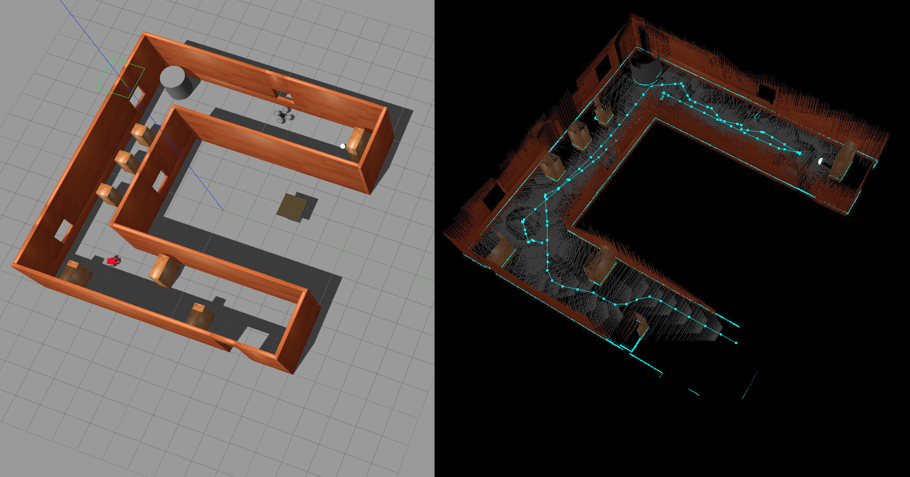
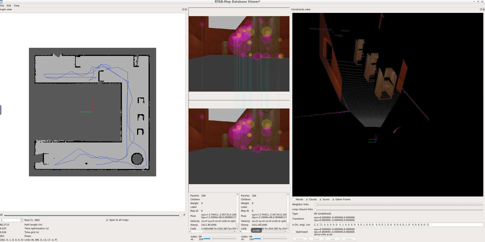

# udacity-robond-p4

**Map My World - Project 4 of the Udacity Robotics Software Engineer Nanodegree**

## Description

This project contains:

1. A two-wheeled robot model (URDF) which is equiped with a RGBD camera and a lidar.
2. A customized world supported by Gazebo. 
3. Three ROS packages: the `localization` , the `my_robot`  and `mapping`, which enable the robot to localize itself using Adaptive Monte Carlo Localization (http://wiki.ros.org/amcl) method as well as perform mapping in the environment and detect closed loops using `RTAB-MAP` ROS package. 

## Run 

`roslaunch my_robot world.launch`

`rosrun teleop_twist_keyboard teleop_twist_keyboard.py`

`roslaunch mapping mapping.launch`

## Behavior

 

## Complete Map

Check the link below for a complete map database  `rtabmap.db`

https://drive.google.com/file/d/1H7ilPpPP5pIrL6AC4G7XPBvyUIotqjqL/view?usp=sharing

